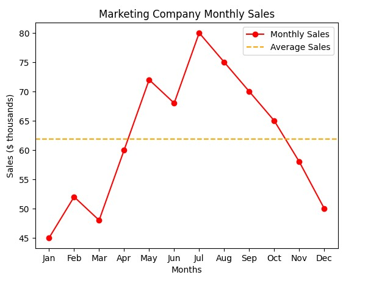

# 📊 Marketing Company Monthly Sales Visualization

This project presents a **data visualization using Python and Matplotlib** to analyze monthly sales performance for a marketing company. The chart illustrates trends across the year and compares monthly performance against the annual average.



---

## 🔍 Project Overview

Understanding sales patterns over time is essential for performance evaluation and strategic planning. This visualization helps to:

- Track **monthly sales trends**
- Identify **seasonal peaks and declines**
- Compare each month against the **average annual sales**

All sales values are represented in **thousands of dollars**.

---

## 📈 Dataset

- **Period:** January – December  
- **Metric:** Monthly sales ($ thousands)  
- **Number of data points:** 12  

```python
monthly_sales = [45, 52, 48, 60, 72, 68, 80, 75, 70, 65, 58, 50]
